# #100DaysOfCode

[Commit #100DaysOfCode Reboot challenge](https://twitter.com/dwz_wong_01/status/1652924763826978816)

## Table Of Content
- [Logs](#logs)

## Logs

### Day 1:
1. Learn the basics of HTML
2. Writing Semantic HTML
3. Watching [HTML Full Course - Build a Website Tutorial](https://www.youtube.com/watch?v=pQN-pnXPaVg) by freeCodeCamp
    - Introduction
    - Choosing a Text Editor
    - Creating an HTML file
    - Basic Tags
    - Comments
    - Style & Color
    - Formatting a Page
    - Links

### Day 2:
1. freeCodeCamp Legacy Responsive Web Design:
    - Basic HTML and HTML5
2. Continue and completed watching [HTML Full Course - Build a Website Tutorial by freeCodeCamp](https://www.youtube.com/watch?v=pQN-pnXPaVg)
    - Images
    - Videos & Youtube iFrames
    - Lists
    - Tables
    - Divs & Spans
    - Input & Forms
    - iFrames
    - Meta Tags

### Day 3:
1. HTML Best Practices

### Day 4:
1. Watching [HTML and CSS Tutorial for 2021 - COMPLETE Crash Course!](https://www.youtube.com/watch?v=D-h8L5hgW-w) by DesignCourse
    - Introduction
    - A Special Offer
    - Code Editor
    - Writing the HTML
    - Writing the CSS

### Day 5:
1. Continue and completed watching [HTML and CSS Tutorial for 2021 - COMPLETE Crash Course!](https://www.youtube.com/watch?v=D-h8L5hgW-w) by DesignCourse
    - Mobile Navigation
    - Responsive CSS
    - Closing
2. freeCodeCamp Legacy Responsive Web Design:
    - Basic CSS

### Day 6 - 8:
- Frontend Mentor:
    - Base Apparel coming soon page
          
        [Challenge Page](https://www.frontendmentor.io/challenges/base-apparel-coming-soon-page-5d46b47f8db8a7063f9331a0) | [Solution](https://www.frontendmentor.io/solutions/base-apparel-coming-soon-page-V2Men5aU2g) | [Code](https://github.com/dwz-wong/100daysofcode-reboot/tree/main/day6-8/base-apparel-coming-soon-master) | [Live](https://day6-8-of-100days-reboot.netlify.app/)

### Day 9:
1. Watching [Frontend Web Development Bootcamp Course (JavaScript, HTML, CSS)](https://www.youtube.com/watch?v=zJSY8tbf_ys&t=30192s) by freeCodeCamp
    - Introduction
    - Your first JavaScript program
    - What is JavaScript?

### Day 10:
1. Continue watching [Frontend Web Development Bootcamp Course (JavaScript, HTML, CSS)](https://www.youtube.com/watch?v=zJSY8tbf_ys&t=30192s) by freeCodeCamp
    - JavaScript variables
    - Basic JavaScript challenges

### Day 11:
1. Continue watching [Frontend Web Development Bootcamp Course (JavaScript, HTML, CSS)](https://www.youtube.com/watch?v=zJSY8tbf_ys&t=30192s) by freeCodeCamp
    - JavaScript operators
    - 5 more JavaScript challenges

### Day 12:
1. Continue watching [Frontend Web Development Bootcamp Course (JavaScript, HTML, CSS)](https://www.youtube.com/watch?v=zJSY8tbf_ys&t=30192s) by freeCodeCamp
    - JavaScript functions, conditionals, loops

### Day 13:
1. Continue watching [Frontend Web Development Bootcamp Course (JavaScript, HTML, CSS)](https://www.youtube.com/watch?v=zJSY8tbf_ys&t=30192s) by freeCodeCamp
    - 25 Beginner JavaScript practice problems (3:55:03 => 4:52:53)

### Day 14:
1. Continue watching [Frontend Web Development Bootcamp Course (JavaScript, HTML, CSS)](https://www.youtube.com/watch?v=zJSY8tbf_ys&t=30192s) by freeCodeCamp
    - 25 Beginner JavaScript practice problems (4:52:53 => 6:07:47)
2. HackerRank Tutorials: 10 Days of JavaScript
    - Day 0: Hello, World!
    - Day 0: Data Types
    - Day 1: Arithmetic Operators
    - Day 2: Loops
    - Day 7: Regular Expressions I

### Day 15:
1. Continue watching [Frontend Web Development Bootcamp Course (JavaScript, HTML, CSS)](https://www.youtube.com/watch?v=zJSY8tbf_ys&t=30192s) by freeCodeCamp
    - Built-in JavaScript methods
    - Callback functions
    - JavaScript primitives
    - JavaScript Dates
    - Regular Expressions
2. HackerRank Tutorials: 10 Days of JavaScript
    - Day 1: Functions
    - Day 1: Let and Const

### Day 16 - 18:
1. Build my simple portfolio page  
    **Desktop**  
    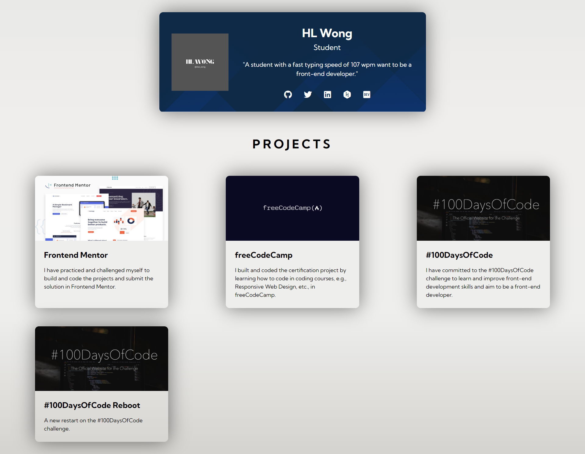

    **Tablet**  
    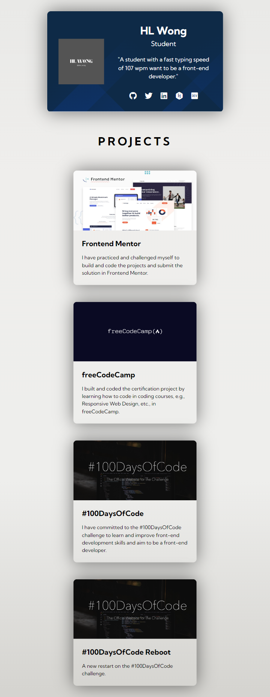

    **Mobile**  
    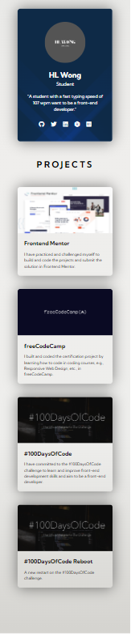  
    [Live](https://dwz-wong.netlify.app/)

### Day 19:
1. Continue watching [Frontend Web Development Bootcamp Course (JavaScript, HTML, CSS)](https://www.youtube.com/watch?v=zJSY8tbf_ys&t=30192s) by freeCodeCamp
    - JavaScript String methods
    - JavaScript Array methods
    - Math utilities with JavaScript
2. HackerRank Tutorials: 10 Days of JavaScript
    - Day 2: Conditional Statements: if-Else
    - Day 2: Conditional Statements: Switch

### Day 20:
1. HackerRank Tutorials: 10 Days of JavaScript
    - Day 4: Count Objects
    - Day 8: Create a Button

### Day 21:
1. freeCodeCamp Front End Development Libraries:
    - Bootstrap
        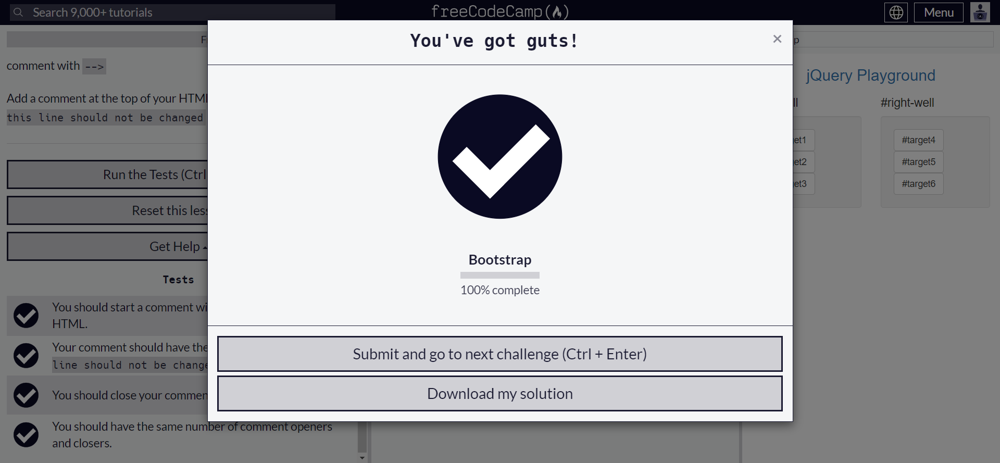
        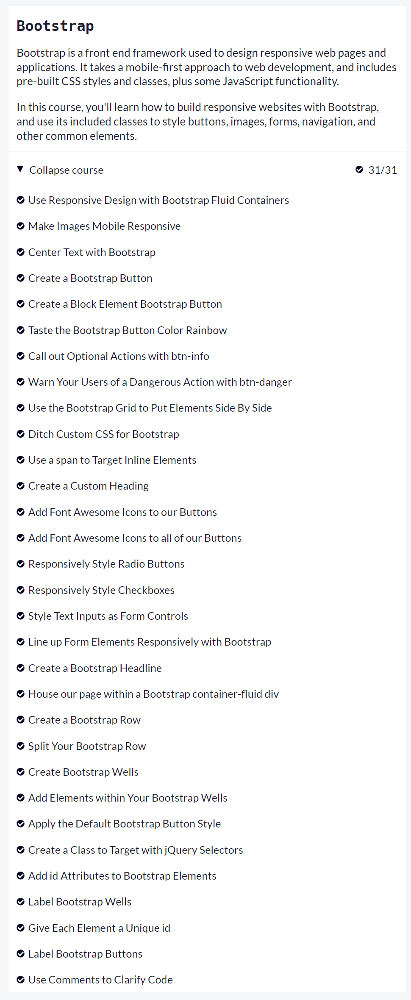
    - jQuery
        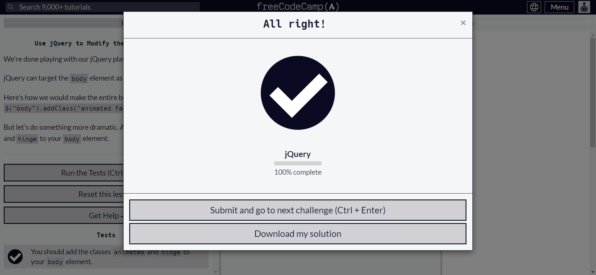
        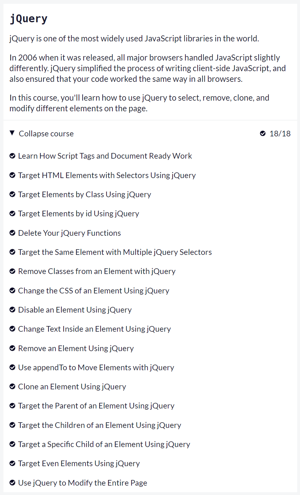

### Day 22:
1. freeCodeCamp Front End Development Libraries
    - SASS
        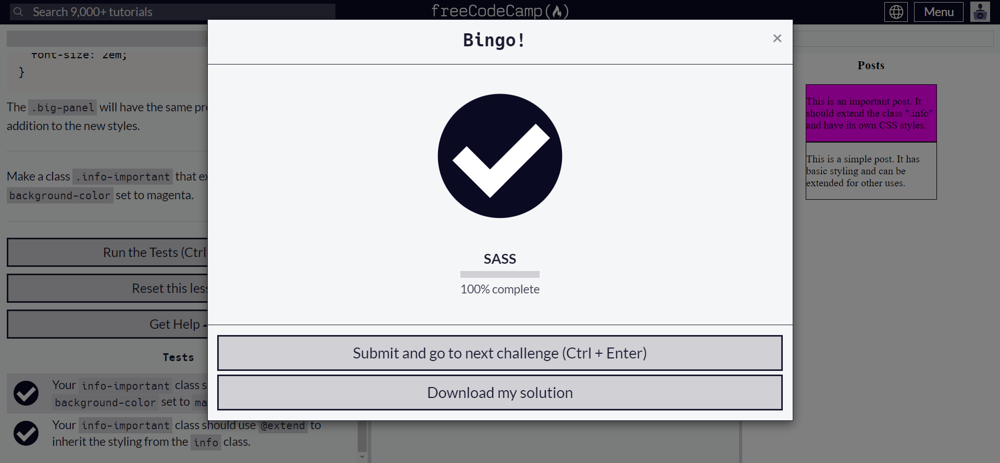
        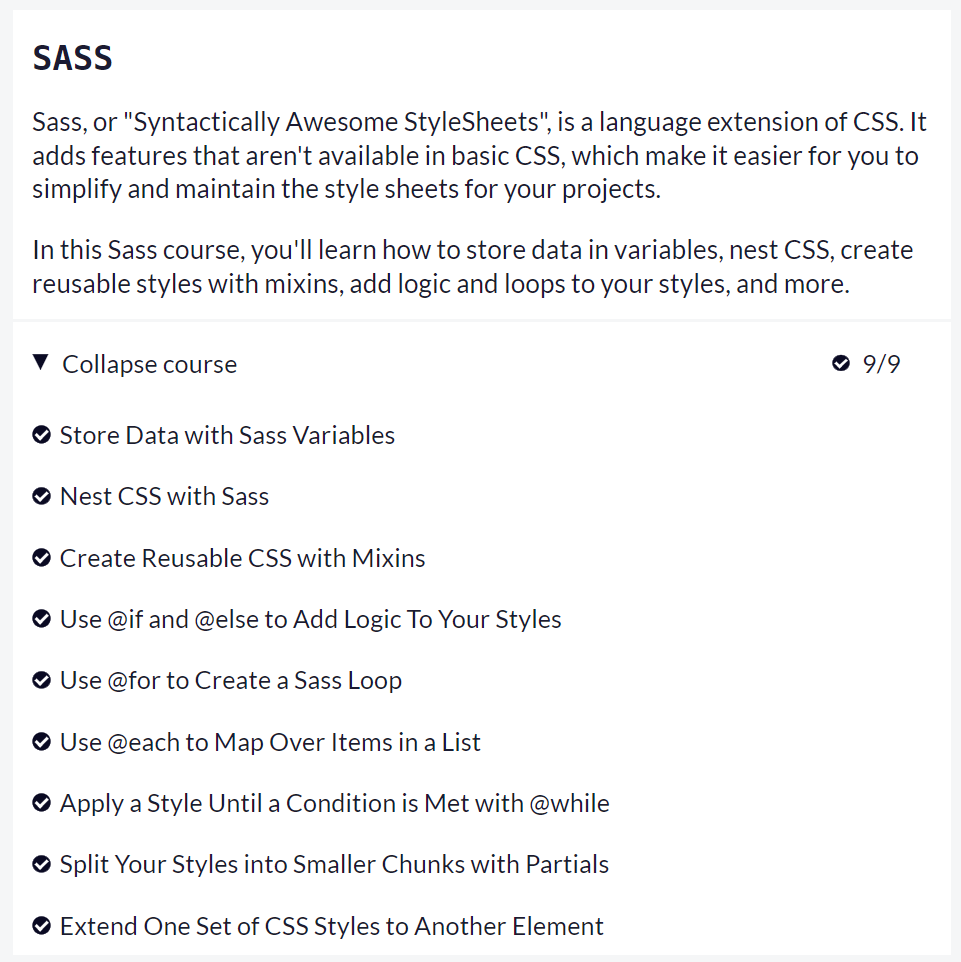
    - React
        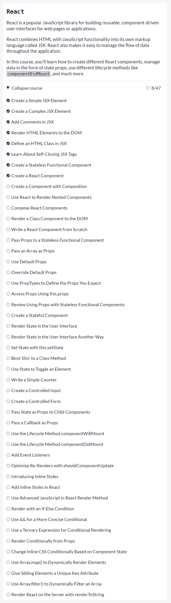

### Day 23 - 24:
- Frontend Mentor:
    - News homepage
         
         
        [Challenge Page](https://www.frontendmentor.io/challenges/newsletter-signup-form-with-success-message-3FC1AZbNrv) | [Solution](https://www.frontendmentor.io/solutions/news-homepage-iMcl7mg3Kq) | [Code](https://github.com/dwz-wong/100daysofcode-reboot/tree/main/day23-24/news-homepage-main) | [Live](https://day23-24-of-100days-reboot.netlify.app/)

### Day 25 - 27:
- Frontend Mentor:
    - Newsletter sign-up form with success message
        
         
        [Challenge Page](https://www.frontendmentor.io/challenges/newsletter-signup-form-with-success-message-3FC1AZbNrv) | [Solution](https://www.frontendmentor.io/solutions/newsletter-signup-form-with-success-message-xqIJWFEJ_v) | [Code](https://github.com/dwz-wong/100daysofcode-reboot/tree/main/day25-27/newsletter-sign-up-with-success-message-main) | [Live](https://day25-27-of-100days-reboot.netlify.app/)

### Day 28:
1. Create Skills Progress Bar with CSS Animaiton

### Day 29 - 30:
- Frontend Mentor:
    - Testimonials grid section
        
         
        [Challenge Page](https://www.frontendmentor.io/challenges/testimonials-grid-section-Nnw6J7Un7) | [Solution](https://www.frontendmentor.io/solutions/testimonials-grid-section-ra20eA_bJm) | [Code](https://github.com/dwz-wong/100daysofcode-reboot/tree/main/day29-30/testimonials-grid-section-main) | [Live](https://day29-30-of-100days-reboot.netlify.app/)

### Day 31 - 33:
- Frontend Mentor:
    - Notifications page
        
         
        [Challenge Page](https://www.frontendmentor.io/challenges/notifications-page-DqK5QAmKbC) | [Solution](https://www.frontendmentor.io/solutions/notifications-page-EakjHRoBCI) | [Code](https://github.com/dwz-wong/100daysofcode-reboot/tree/main/day31-33/notifications-page-main) | [Live](https://day31-33-of-100days-reboot.netlify.app/)

### Day 34 - 40:
- Frontend Mentor:
    - Calculator app
        
         
        [Challenge Page](https://www.frontendmentor.io/challenges/calculator-app-9lteq5N29) | [Solution](https://www.frontendmentor.io/solutions/calculator-app-tWGSxxRB1x) | [Code](https://github.com/dwz-wong/100daysofcode-reboot/tree/main/day34-40/calculator-app-main) | [Live](https://day34-40-of-100days-reboot.netlify.app/)

### Day 41:
1. A day of learning CSS Animation and making banner flag
    

### Day 42 - 43:
- Tic Tac Toe
    
    [Code](https://github.com/dwz-wong/100daysofcode-reboot/tree/main/day42-43/tic-tac-toe) | [Live](https://day42-43-of-100days-reboot.netlify.app/)

### Day 44:
1. Enroll a new course "Learn React" from Scrimba
    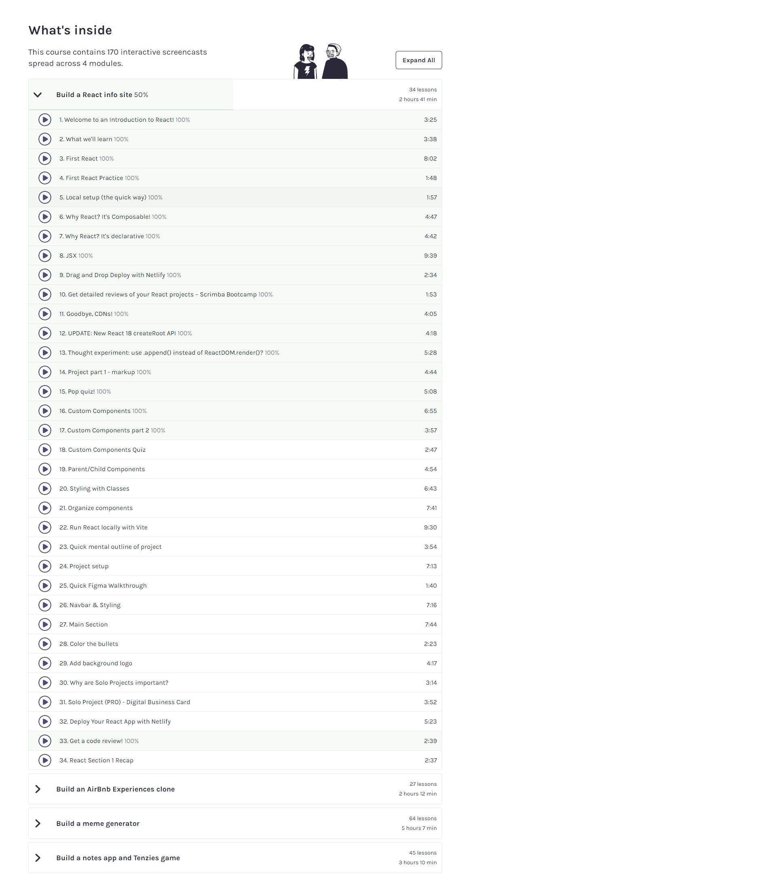

### Day 45:
1. "Learn React" course from Scrimba:  
🚧 Build a React info site (77%)  
🏳️ Build an AirBnB Experiences clone  
🏳️ Build a meme generator  
🏳️ Build a notes app and Tenzies game 
    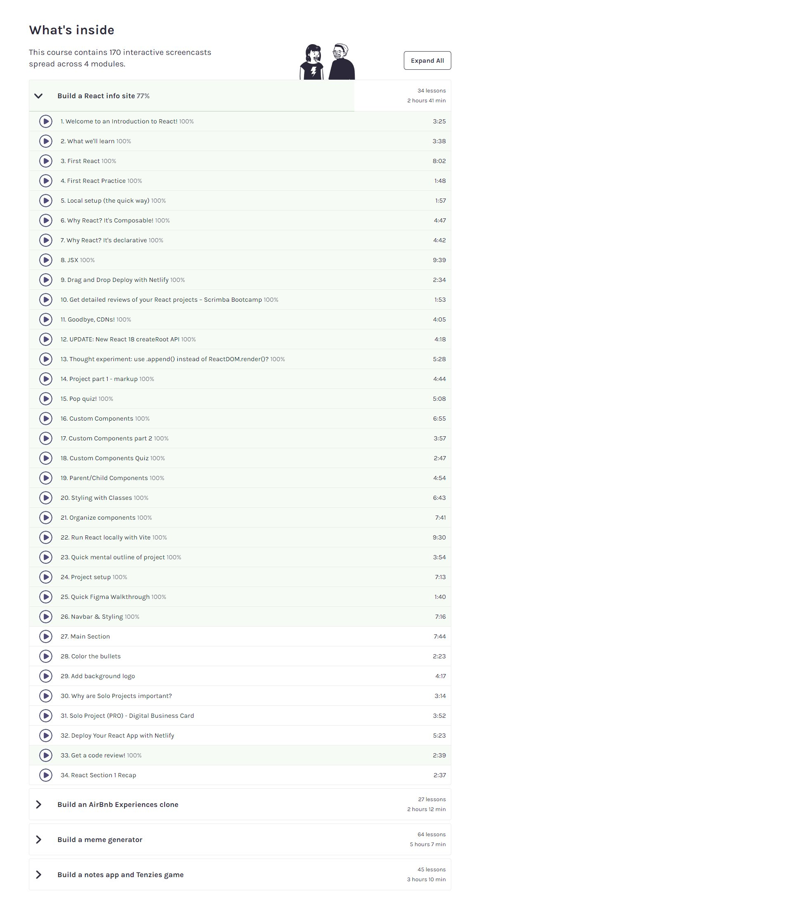
         
### Day 46:
1. "Learn React" course from Scrimba:  
✅ Build a React info site (98%, Solo Project required to subscribe PRO member)  
🏳️ Build an AirBnB Experiences clone  
🏳️ Build a meme generator  
🏳️ Build a notes app and Tenzies game  
    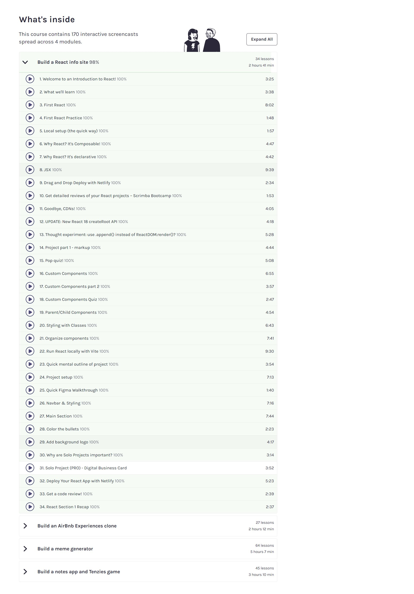

### Day 47:
- Scrimba:
    - Solo Project - Digital Business Card from Scrimba
        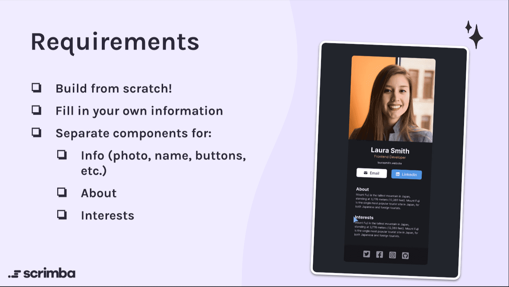  
        

### Day 48:
- Frontend Mentor
    - Single price grid component
    
     
    [Challenge Page](https://www.frontendmentor.io/challenges/single-price-grid-component-5ce41129d0ff452fec5abbbc) | [Solution](https://www.frontendmentor.io/solutions/single-price-grid-component-Bw-1Twbsiy) | [Code](https://github.com/dwz-wong/100daysofcode-reboot/tree/main/day48/single-price-grid-component-master) | [Live](https://day48-of-100days-reboot.netlify.app/)
